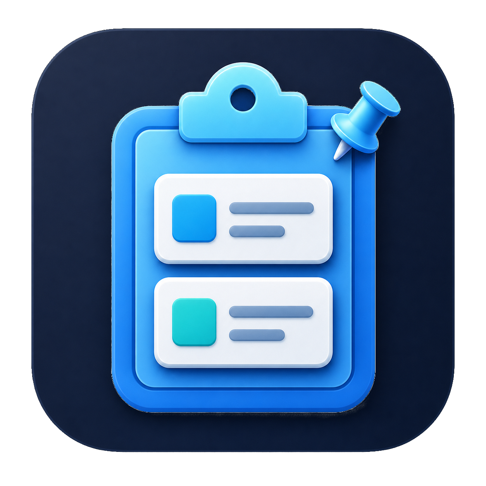
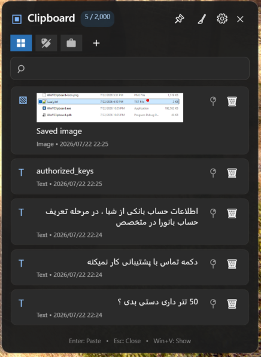

# WinVClipboard

A fast, native Windows clipboard manager with the familiar `Win + V` experience, a much larger history, pins, categories, and text expansion.

[فارسی](README.md) · [Changelog](CHANGELOG.md) · [Download latest release](https://github.com/PouryaRajaei/WinVClipboard/releases/latest)





## Why WinVClipboard?

Windows' built-in clipboard keeps a limited history and offers little organization. WinVClipboard preserves the speed of `Win + V` while adding up to 2,000 entries, persistent pins, icon-based categories, image thumbnails, and system-wide text expansion.

## Features

- Opens with `Win + V` while suppressing the built-in Windows clipboard panel
- Stores up to 2,000 text, image, and file entries
- Displays image thumbnails immediately and persists image data in the background
- Pins important entries; pinned entries stay at the end of the list
- Dedicated pinned-only filter
- Pastes the first nine pinned entries with `Ctrl + 1` through `Ctrl + 9`
- Organizes pins into icon-only category chips using Material Design icons
- Creates, edits, deletes, and assigns custom icons to categories
- Live search across text and file names
- Automatic text direction: Persian and Arabic use RTL; English uses LTR
- Keyboard navigation with the arrow keys and `Enter`
- Double-click paste into the previously focused window without restoring a maximized window
- Opens on the monitor containing the mouse pointer
- Correct multi-monitor and mixed-DPI positioning
- Single-instance operation
- Hidden startup mode via the `--startup` argument
- Fully bilingual Persian/English UI with instant RTL/LTR switching and a persisted language preference
- Three persistent panel sizes: small, medium, and large
- System Tray icon with quick Open, Settings, and Exit actions
- In-app Start with Windows control
- Dedicated General, Appearance, Privacy, Backup, and About settings pages
- Backup and restore for history, pins, categories, text shortcuts, and settings
- Capture pause, image exclusion, retention policy, and sensitive-app exclusions
- Dark, Light, and System themes; configurable history and thumbnail sizes
- Live recording of any supported global panel hotkey and selectable `Ctrl/Alt + 1…9` pinned shortcuts
- Dedicated Text Shortcuts settings tab with add, inline edit, and remove actions
- GitHub Releases update checking
- Seamless architecture-aware download, installation, and automatic relaunch
- Automated x64/ARM64 builds, optional signing, and MSIX tooling

## Text expansion

Define a trigger and its replacement, for example:

```text
Shortcut:    /addr1
Description: Tehran, Example Street
```

After `/addr1` is typed into a text input, a suggestion appears next to the text caret on the same monitor. Press `Tab` to replace the trigger or `Esc` to dismiss it. Replacement uses Unicode input and does not overwrite the current clipboard.

## Controls

| Action | Key or gesture |
|---|---|
| Open the panel | `Win + V` |
| Move through entries | `↑` / `↓` |
| Paste selected entry | `Enter` |
| Paste immediately | Double-click an entry |
| Hide the panel | `Esc` |
| Paste pinned entries 1–9 | `Ctrl + 1` … `Ctrl + 9` |
| Accept text suggestion | `Tab` |
| Dismiss text suggestion | `Esc` |
| Exit completely | Exit button or `Alt + F4` |

## Install

1. Download the correct archive from [Releases](https://github.com/PouryaRajaei/WinVClipboard/releases):
   - `win-x64` for most Intel and AMD PCs
   - `win-arm64` for Windows on ARM devices
2. Extract the ZIP archive.
3. Run `WinVClipboard.exe`.

Release binaries are self-contained, so they do not require a separate .NET installation.

> WinVClipboard uses a global keyboard hook to handle `Win + V` and text expansion. Some security tools may ask for confirmation on first launch.

### Start with Windows

Create a shortcut to the executable in the Windows Startup folder and append `--startup` to its Target:

```text
"C:\Path\To\WinVClipboard.exe" --startup
```

Press `Win + R` and enter `shell:startup` to open that folder.

## Build from source

Requirements: Windows 10/11, the [.NET 10 SDK](https://dotnet.microsoft.com/download/dotnet/10.0), and Git.

```powershell
git clone https://github.com/PouryaRajaei/WinVClipboard.git
cd WinVClipboard
dotnet restore
dotnet build -c Release
```

Publish self-contained executables:

```powershell
dotnet publish -c Release -r win-x64 --self-contained true -p:PublishSingleFile=true -p:IncludeNativeLibrariesForSelfExtract=true
dotnet publish -c Release -r win-arm64 --self-contained true -p:PublishSingleFile=true -p:IncludeNativeLibrariesForSelfExtract=true
```

## Local data

History, categories, and text shortcuts are stored locally in:

```text
%LOCALAPPDATA%\WinVClipboard
```

The application does not include cloud sync or send clipboard data anywhere.

## Versioning

The project follows [Semantic Versioning](https://semver.org/) using `MAJOR.MINOR.PATCH`:

- `MAJOR` for incompatible changes
- `MINOR` for backward-compatible features
- `PATCH` for backward-compatible fixes

Current version: **1.4.0**. Release notes are maintained in [CHANGELOG.md](CHANGELOG.md).

See [STORE-PUBLISHING.md](STORE-PUBLISHING.md) for packaging and Store submission instructions.

## Contributing

Bug reports and feature requests are welcome in [Issues](https://github.com/PouryaRajaei/WinVClipboard/issues). For code changes, create a focused branch and open a pull request.

## License status

No license file has been added yet, so reuse and redistribution rights are not automatically granted. Before broad public distribution, choose a license such as MIT and add a `LICENSE` file.
